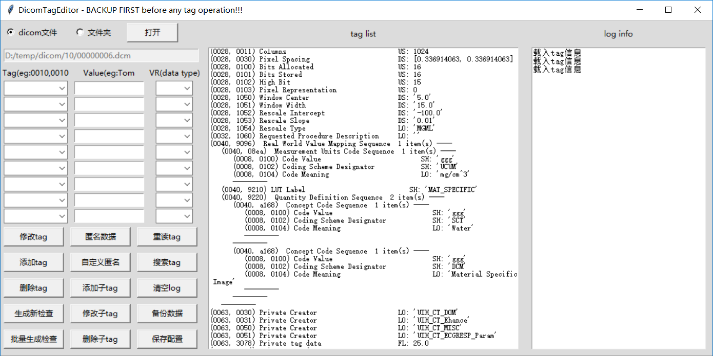
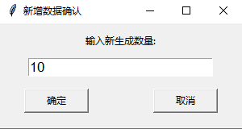
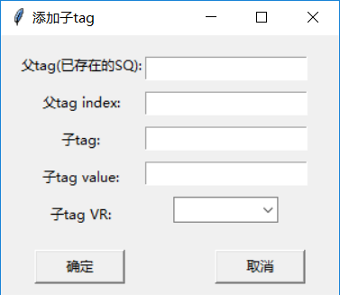
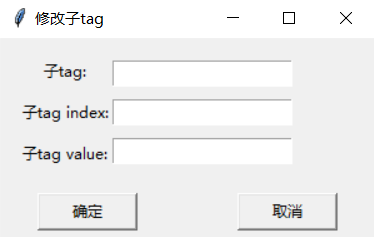

# Dicom-editer
### 1、界面：

### 2、打开方式：可以打开dcm文件或者包含dcm文件的文件夹（可包含多个检查）
### 3、普通tag操作：在显示表格中输入需要修改的tag，点击左侧三个tag操作，修改tag时，Tag和Value有效，添加tag时Tag，value和VR都有效，删除tag时只有Tag有效
### 4、生成新检查：将当前打开文件或文件夹修改为新的检查，导入工作站后独立显示，当打开的文件夹为多个检查时，生成的新检查也是多个（修改0020000d，0020000d，00080018三个tag为唯一值，如果检查中序列有定位像是根据此三个tag进行匹配的，需要根据定位像规则进行相应tag修改）
### 5、批量生成检查：点击后的弹窗中输入生成数量，复制文件或文件夹到到所在目录，命名在原名称后加数字，并生成新检查

### 6、匿名数据，将数据患者姓名，出生日期，检查者姓名进行匿名化处理，默认匿名为Anonymous，匿名同时生成新检查
### 7、自定义匿名，在弹窗中输入匿名的数据名称，将患者姓名匿名为设置名称
### 8、多层tag操作：添加子tag需要父tag（SQ）存在，在弹出窗口中输入添加的tag信息，父tag index可以通过搜索tag进行确定。 修改子tag，index也可以通过搜索tag确定。删除子tag，首先需要定位父tag，然后在父tag中查看子tag的内index（父tag中的相同子tag，没有相同子tag，index为1）

### 9、重读tag，重新读取文件tag，一般修改后点击，文件夹打开时读取第一个文件的tag信息
### 10、搜索tag，根据面板上输入的Tag，输出打开的文件中相关tag信息，可用于定位相同tag的index
### 11、清空log，将log输出框清空
### 12、备份数据： 将文件或文件夹复制一份，名称后加_bkp
### 13、保存配置，保存面板输入内容和Tag下拉菜单，下次打开的时候自动填入